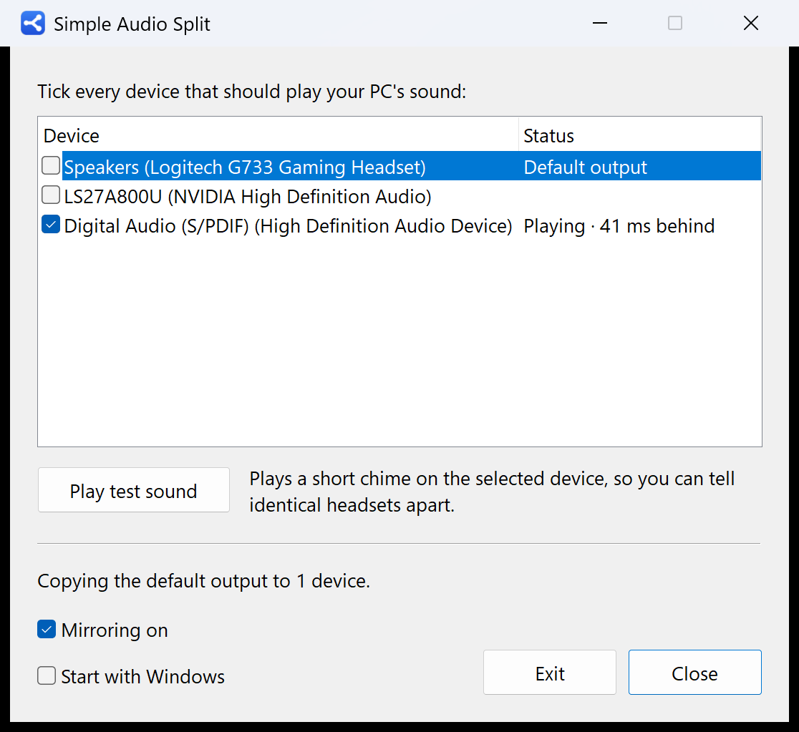

# Simple Audio Split

[](https://github.com/limbon2/simple-audio-split/actions/workflows/build.yml)

Plays your PC's sound on several output devices at once, for example two wireless
headsets. Tick the devices and you're done: no virtual cables, buses or routing.



Windows has no built-in way to do this for wired or USB devices. The usual advice is
a virtual mixer such as Voicemeeter, which works but takes a lot of setup for
something this simple.

## Download

Get `SimpleAudioSplit.exe` from the [latest release](https://github.com/limbon2/simple-audio-split/releases/latest).
It's a single file for 64-bit Windows 10 and 11: nothing to install, no drivers, no admin rights.

The app isn't code-signed, so the first time you run it Windows may say "Windows
protected your PC". Click **More info**, then **Run anyway**, or build it yourself
(see below).

## Using it

1. Run `SimpleAudioSplit.exe`.
2. Tick every device that should play the sound. The Windows default output always
   plays (it's where the sound comes from); every other ticked device gets a copy.
3. Two identical headsets have near-identical names. Select one and press
   **Play test sound** to hear which is which.

**Close** hides the window and keeps the sound playing; the app stays in the
notification area (click its icon or start the app again to reopen it). **Exit**
stops it. Tick **Start with Windows** to have it start silently in the tray when you
sign in. Your choices are remembered, including after a headset's USB receiver moves
to another port.

The copy plays about 40 ms behind the default output. That's not noticeable for two
people listening or watching together. Each headset keeps its own volume control, and
the copy also appears as "Simple Audio Split" in that device's volume mixer.

## How it works

The app records what the default output is playing (WASAPI loopback) and plays it on
each ticked device. Every sound device runs on its own clock, and two clocks always
differ slightly, typically by 10 to 300 parts per million. Played naively, the copy
would slowly drift out of sync and then crackle. Here, each copy goes through a
high-quality resampler whose rate is adjusted continuously to keep the buffer level
steady. The adjustment is a few hundred ppm at most, far too small to hear as a pitch
change. Channel layouts are converted as needed (e.g. 7.1 virtual surround to stereo),
as are sample rates (44.1 kHz to 48 kHz).

Devices that are unplugged, plugged back in, reconfigured, or taken over by an
exclusive-mode app are reopened automatically. Changing the Windows default device
switches the source. A real-time thread only moves audio, while device handling runs
on a separate thread, so opening one device never interrupts another. CPU use is
around 0.2% of one core.

## Building

Needs Visual Studio 2022 or later with the **Desktop development with C++** workload.

```
build.bat
```

This produces:

| File | What |
| --- | --- |
| `build\SimpleAudioSplit.exe` | The app (single file, no runtime needed) |
| `build\sas-cli.exe` | Console diagnostics, see below |
| `build\dsp_test.exe` | Offline tests for the resampler, drift control and channel mapping |

`python tools\make_icon.py` regenerates the icons. Pushing a tag like `v1.2.0` makes
GitHub Actions build the app and publish it as a release.

## Diagnostics

```
sas-cli list                                    devices with their formats
sas-cli run --target 1 [--target 2] [--seconds 60]   mirror the default output, print stats every second
sas-cli verify --source 0 --target 1            play quiet noise on 0, mirror it, check 1 carries an exact copy
sas-cli churn --target 1 --target 2             keep 1 playing while 2 is added and removed
sas-cli tone 1                                  play the test chime
```

Devices are given by their index in `list`, `default`, or a device ID. Set
`SAS_TRACE=1` to log device opens and the first buffer refills.

## Source layout

| File | What |
| --- | --- |
| `src/dsp.h` | Sample conversion, channel mapping, resampling FIFO, drift controller, `MirrorPipeline` |
| `src/engine.cpp` | Audio thread (moves audio) and control thread (opens and closes devices) |
| `src/app.cpp` | Window, tray icon, settings |
| `src/wasapi_util.cpp` | Device enumeration, formats, error messages |
| `src/tone.cpp` | Test chime |
| `src/cli.cpp` | `sas-cli` |

## Privacy and uninstalling

The app never connects to the internet. Your device choices are stored in
`%APPDATA%\SimpleAudioSplit\settings.ini`, and **Start with Windows** adds a
`SimpleAudioSplit` entry under `HKCU\Software\Microsoft\Windows\CurrentVersion\Run`.

To uninstall, untick **Start with Windows**, press **Exit**, then delete the exe and
that folder.

## License

[MIT](LICENSE)
